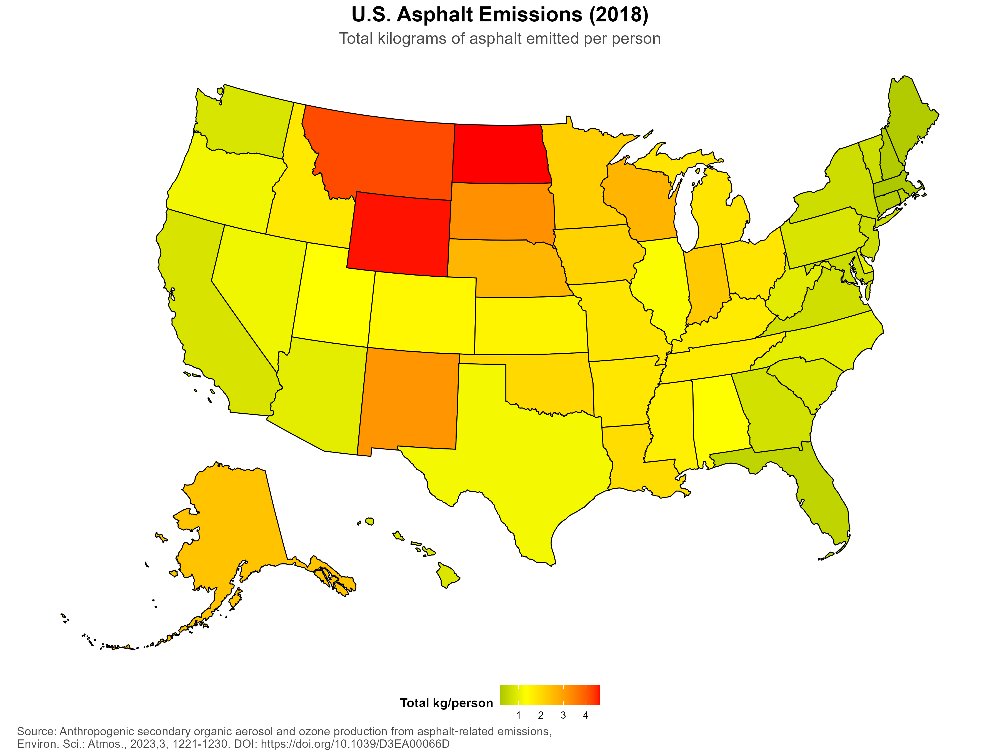

# U.S. Asphalt Emissions (2018) – Choropleth Map  



*Figure: A choropleth of total kilograms of asphalt emitted per person across all U.S. states in 2018.*

---

## 📚 Citation  

*Anthropogenic secondary organic aerosol and ozone production from asphalt‑related emissions*,  
Environ. Sci.: Atmos., **2023**, 3, 1221‑1230. DOI: <https://doi.org/10.1039/D3EA00066D>

---

## 📁 Project Structure  

| Folder / File | Purpose |
|---------------|---------|
| `data/`       | Raw data files (downloaded Excel workbook) |
| `plots/`      | Generated graphics (e.g., PNG map) |
| `scripts/`    | R script that creates the map and handles all logic (`make_asphalt_chloropleth.R`) |
| `README.md`   | This file – contains a preview of the map, citation, and links to all other files |
| `plan.md`     | Implementation plan (high‑level steps) |
| `tasks.md`    | Granular checklist used during development |
| `.gitignore`  | Files/folders ignored by Git (keeps `data/` & `plots/` tracked) |

---

## 📁 Project tree

```
asphalt_emissions_2018_nemotron_3_nano_30b_128k/
│
├── README.md
├── prompt.md
├── output.md
├── plan.md
├── tasks.md
├── .gitignore
│
├── data/                # ← created automatically if missing
│   └── AP_2018_State_County_Inventory.xlsx
├── plots/               # ← created automatically if missing
│   └── us_asphalt_2018.png
│
└── scripts/
    └── make_asphalt_chloropleth.R        <-- the R script you will run
```

---

## 🔗 Links to Markdown files  

- [prompt.md](prompt.md) – Instructions for GenAI model.
- [output.md](output.md) – Original GenAI output.
- [plan.md](plan.md) – Implementation plan.  
- [tasks.md](tasks.md) – Task checklist.

## Colophon

This project was created using Ollama CLI and nemotron-3-nano:30b with a custom context length (131072 tokens). (See [Modelfile](Modelfile.nemotron-3-nano_30b-128k).) The [prompt](prompt.md) is shown in the output below have a token count of 1237 tokens.

```bash
ollama pull nemotron-3-nano:30b
ollama create nemotron-3-nano:30b-128k -f Modelfile.nemotron-3-nano_30b-128k
ollama run --verbose nemotron-3-nano:30b-128k < prompt.md > output.md
```

```
total duration:       1m54.0804618s
load duration:        88.6625ms
prompt eval count:    1237 token(s)
prompt eval duration: 1.3388937s
prompt eval rate:     923.90 tokens/s
eval count:           6604 token(s)
eval duration:        1m24.0513306s
eval rate:            78.57 tokens/s
```

The original script was copied from [output.md](output.md) and saved as [make_asphalt_choropleth.orig.R](scripts/make_asphalt_choropleth.orig.R). Bugs were fixed manually and the updated script was saved to the file [make_asphalt_choropleth.R](scripts/make_asphalt_choropleth.R). Those edits can be seen in the [make_asphalt_choropleth.R.diff](scripts/make_asphalt_choropleth.R.diff) `diff` file created with:

```bash
diff -u make_asphalt_choropleth.orig.R make_asphalt_choropleth.R > make_asphalt_choropleth.R.diff
```

The other Markdown files were also created from `output.md` by copying and pasting the content into new files and saving with the appropriate file names. The Walkthrough was not copied to its own file since so much would need to be updated due to bugfixes in the R script. Other than this Colophon and updating Links and Project Tree/Structure sections in this README, the content of the Markdown files was left unchanged.